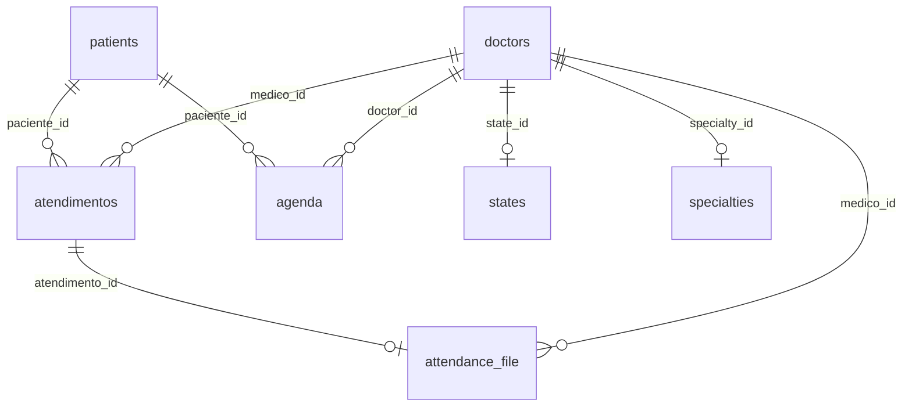

# Database — PEP SoMed

## SGBD

| Especificação | Detalhe |
|---|---|
| **SGBD** | PostgreSQL 16 (Alpine) |
| **Container** | `pep-emr-db` |
| **Porta (dev)** | `5432` (Docker, mapeada para `5433` em caso de conflito local) |
| **Usuário** | `postgres` |
| **Senha** | `postgres` |
| **Database** | `pep_emr` |
| **Migration** | Automática via `server/db.js` (tabela `schema_migrations` rastreia arquivos aplicados) |

---

## Migrations

| # | Arquivo | Conteúdo |
|---|---|---|
| 001 | `001_initial_schema.sql` | Tabelas base: doctors, patients, crm_settings, atendimentos, attendance_file, agenda |
| 002 | `002_memed_integration.sql` | Colunas Memed em doctors: `cpf`, `birth_date`, `first_name`, `last_name`, `crm`, `crm_uf`, `memed_token`, `memed_id` |
| 003 | `003_memed_cache.sql` | Tabelas de cache: `memed_cidades`, `memed_especialidades` |
| 004 | `004_profile_and_support.sql` | Tabelas de referência: `states`, `specialties` + colunas de perfil em doctors: `gender`, `email`, `phone`, `board_type`, `state_id`, `specialty_id`, `req_number` |

---

## Tabelas de Referência

### `states`

```sql
CREATE TABLE IF NOT EXISTS states (
  id SERIAL PRIMARY KEY,
  name TEXT NOT NULL,
  abbreviation TEXT NOT NULL UNIQUE
);
```

| Coluna | Tipo | Restrições |
|---|---|---|
| `id` | `SERIAL` | `PRIMARY KEY` |
| `name` | `TEXT` | `NOT NULL` |
| `abbreviation` | `TEXT` | `NOT NULL`, `UNIQUE` |

**Dados:** 27 estados brasileiros (AC a TO).

---

### `specialties`

```sql
CREATE TABLE IF NOT EXISTS specialties (
  id SERIAL PRIMARY KEY,
  name TEXT NOT NULL UNIQUE
);
```

| Coluna | Tipo | Restrições |
|---|---|---|
| `id` | `SERIAL` | `PRIMARY KEY` |
| `name` | `TEXT` | `NOT NULL`, `UNIQUE` |

**Dados:** 33 especialidades médicas (Acupuntura a Urologia).

---

### `memed_cidades`

Cache de cidades da API Memed (expira a cada 24h).

```sql
CREATE TABLE IF NOT EXISTS memed_cidades (
  id SERIAL PRIMARY KEY,
  nome TEXT NOT NULL,
  uf TEXT NOT NULL,
  fetched_at TIMESTAMPTZ NOT NULL DEFAULT CURRENT_TIMESTAMP
);
```

---

### `memed_especialidades`

Cache de especialidades da API Memed (expira a cada 24h).

```sql
CREATE TABLE IF NOT EXISTS memed_especialidades (
  id SERIAL PRIMARY KEY,
  nome TEXT NOT NULL,
  fetched_at TIMESTAMPTZ NOT NULL DEFAULT CURRENT_TIMESTAMP
);
```

---

## DDL — Schema das Tabelas

### `doctors`

Médicos cadastrados no sistema — concentra dados pessoais e profissionais.

```sql
CREATE TABLE IF NOT EXISTS doctors (
  id                  SERIAL PRIMARY KEY,
  nome                TEXT NOT NULL,
  clinic_id           INTEGER NOT NULL DEFAULT 1,
  google_access_token TEXT,
  google_refresh_token TEXT,
  google_calendar_id  TEXT,
  data_criacao        TIMESTAMPTZ NOT NULL DEFAULT CURRENT_TIMESTAMP,
  -- Perfil pessoal (migration 002 / 004)
  first_name          TEXT,
  last_name           TEXT,
  cpf                 TEXT,
  birth_date          DATE,
  gender              TEXT,
  email               TEXT,
  phone               TEXT,
  -- Perfil profissional
  board_type          TEXT DEFAULT 'CRM',
  crm                 TEXT,
  crm_uf              TEXT,
  state_id            INTEGER REFERENCES states(id),
  specialty_id        INTEGER REFERENCES specialties(id),
  req_number          TEXT,
  -- Memed
  memed_token         TEXT,
  memed_id            TEXT
);
```

| Coluna | Tipo | Restrições | Descrição |
|---|---|---|---|
| `id` | `SERIAL` | `PRIMARY KEY` | ID auto-incremento (usado como external_id na Memed) |
| `nome` | `TEXT` | `NOT NULL` | Nome completo (concatenado de first_name + last_name) |
| `clinic_id` | `INTEGER` | `NOT NULL` (default 1) | ID da clínica |
| `first_name` | `TEXT` | — | Nome (split) |
| `last_name` | `TEXT` | — | Sobrenome (split) |
| `cpf` | `TEXT` | — | CPF sem pontuação |
| `birth_date` | `DATE` | — | Data de nascimento (obrigatório para Memed / RDC 1000/25) |
| `gender` | `TEXT` | — | Sexo (Masculino / Feminino) |
| `email` | `TEXT` | — | E-mail |
| `phone` | `TEXT` | — | Telefone (digitos) |
| `board_type` | `TEXT` | Default 'CRM' | Sigla do conselho (CRM, CRO, CRP, COREN) |
| `crm` | `TEXT` | — | Número do conselho |
| `crm_uf` | `TEXT` | — | UF do conselho |
| `state_id` | `INTEGER` | `REFERENCES states(id)` | Estado (FK) |
| `specialty_id` | `INTEGER` | `REFERENCES specialties(id)` | Especialidade (FK) |
| `req_number` | `TEXT` | — | Número REQ |
| `google_access_token` | `TEXT` | — | Token de acesso Google OAuth |
| `google_refresh_token` | `TEXT` | — | Token de refresh Google OAuth |
| `google_calendar_id` | `TEXT` | — | ID do calendário Google (default: "primary") |
| `memed_token` | `TEXT` | — | Token de acesso Memed |
| `memed_id` | `TEXT` | — | External ID na Memed |
| `data_criacao` | `TIMESTAMPTZ` | `NOT NULL` (default now) | Data de criação |

**Seed inicial (3 médicos):**
```sql
INSERT INTO doctors (id, nome, first_name, last_name, clinic_id, cpf, birth_date, crm, crm_uf) VALUES
  (1, 'Dr. Marco Silva', 'Marco', 'Silva', 1, '12345678909', '1980-05-10', '123456', 'SP'),
  (2, 'teste Dr', 'Teste', 'Dr', 1, '98765432100', '1975-11-22', '654321', 'SP'),
  (3, 'Dra. Ana Costa', 'Ana', 'Costa', 1, '11122233344', '1985-03-15', '789012', 'RJ');
```

---

### `patients`

Pacientes cadastrados no sistema.

```sql
CREATE TABLE IF NOT EXISTS patients (
  id          UUID PRIMARY KEY DEFAULT gen_random_uuid(),
  full_name   TEXT NOT NULL,
  birth_date  DATE NOT NULL,
  email       TEXT UNIQUE,
  phone       TEXT,
  document    TEXT,
  kommo_id    TEXT,
  created_at  TIMESTAMPTZ NOT NULL DEFAULT CURRENT_TIMESTAMP,
  updated_at  TIMESTAMPTZ NOT NULL DEFAULT CURRENT_TIMESTAMP
);
```

| Coluna | Tipo | Restrições | Descrição |
|---|---|---|---|
| `id` | `UUID` | `PRIMARY KEY` (default `gen_random_uuid()`) | Identificador único |
| `full_name` | `TEXT` | `NOT NULL` | Nome completo |
| `birth_date` | `DATE` | `NOT NULL` | Data de nascimento |
| `email` | `TEXT` | `UNIQUE` | E-mail |
| `phone` | `TEXT` | — | Telefone |
| `document` | `TEXT` | — | CPF / documento |
| `kommo_id` | `TEXT` | — | ID do contato no CRM Kommo |
| `created_at` | `TIMESTAMPTZ` | `NOT NULL` (default now) | Data de criação |
| `updated_at` | `TIMESTAMPTZ` | `NOT NULL` (default now) | Data de atualização |

**Seed inicial (4 pacientes):**
```sql
-- Dara Amaral, Teste memed, João Pedro, Maria Santos
```

---

### `crm_settings`

Configurações de integração com CRM (Kommo).

```sql
CREATE TABLE IF NOT EXISTS crm_settings (
  id            UUID PRIMARY KEY DEFAULT gen_random_uuid(),
  provider_name TEXT NOT NULL DEFAULT 'kommo',
  api_key       TEXT NOT NULL,
  subdomain     TEXT NOT NULL,
  created_at    TIMESTAMPTZ NOT NULL DEFAULT CURRENT_TIMESTAMP,
  updated_at    TIMESTAMPTZ NOT NULL DEFAULT CURRENT_TIMESTAMP
);
```

| Coluna | Tipo | Restrições | Descrição |
|---|---|---|---|
| `id` | `UUID` | `PRIMARY KEY` | Identificador único |
| `provider_name` | `TEXT` | `NOT NULL` (default 'kommo') | Nome do provedor CRM |
| `api_key` | `TEXT` | `NOT NULL` | Chave de API |
| `subdomain` | `TEXT` | `NOT NULL` | Subdomínio da conta |
| `created_at` | `TIMESTAMPTZ` | `NOT NULL` (default now) | Data de criação |
| `updated_at` | `TIMESTAMPTZ` | `NOT NULL` (default now) | Data de atualização |

> Apenas **um** registro de cada provider é mantido (upsert por `provider_name`).

---

### `atendimentos`

Registros de atendimento (prontuário).

```sql
CREATE TABLE IF NOT EXISTS atendimentos (
  id                          SERIAL PRIMARY KEY,
  medico_id                   INTEGER NOT NULL REFERENCES doctors(id),
  paciente_id                 UUID NOT NULL REFERENCES patients(id),
  anamnese_draft              TEXT,
  orientacao_draft            TEXT,
  laudo_draft                 TEXT,
  atestado_declaracao_draft   TEXT,
  pedido_exames_draft         TEXT,
  prescription_draft          TEXT,
  consentimento_lgpd_draft    TEXT,
  data_hora_criacao           TIMESTAMPTZ NOT NULL DEFAULT CURRENT_TIMESTAMP
);

CREATE INDEX IF NOT EXISTS idx_atendimentos_paciente ON atendimentos (paciente_id);
```

| Coluna | Tipo | Restrições | Descrição |
|---|---|---|---|
| `id` | `SERIAL` | `PRIMARY KEY` | ID auto-incremento |
| `medico_id` | `INTEGER` | `REFERENCES doctors(id)` | Médico responsável |
| `paciente_id` | `UUID` | `REFERENCES patients(id)` | Paciente atendido |
| `anamnese_draft` | `TEXT` | — | Rascunho (JSON: `{"texto": "<html>"}`) |
| `orientacao_draft` | `TEXT` | — | Rascunho (JSON) |
| `laudo_draft` | `TEXT` | — | Rascunho (JSON) |
| `atestado_declaracao_draft` | `TEXT` | — | Rascunho (JSON) |
| `pedido_exames_draft` | `TEXT` | — | Rascunho (JSON) |
| `prescription_draft` | `TEXT` | — | Rascunho (JSON) |
| `consentimento_lgpd_draft` | `TEXT` | — | Rascunho (JSON) |
| `data_hora_criacao` | `TIMESTAMPTZ` | `NOT NULL` (default now) | Data de criação |

**Módulos (FIELD_MAP):**
| Chave | Coluna no banco |
|---|---|
| `anamnese` | `anamnese_draft` |
| `orientacao` | `orientacao_draft` |
| `laudo` | `laudo_draft` |
| `atestado_declaracao` | `atestado_declaracao_draft` |
| `pedido_exames` | `pedido_exames_draft` |
| `prescription` | `prescription_draft` |
| `consentimento_lgpd` | `consentimento_lgpd_draft` |

---

### `attendance_file`

Registro de documentos gerados ao finalizar um atendimento.

```sql
CREATE TABLE IF NOT EXISTS attendance_file (
  id                            SERIAL PRIMARY KEY,
  atendimento_id                INTEGER NOT NULL REFERENCES atendimentos(id) ON DELETE CASCADE,
  medico_id                     INTEGER NOT NULL REFERENCES doctors(id),
  anamnese_url                  TEXT,
  orientacao_url                TEXT,
  laudo_url                     TEXT,
  atestado_declaracao_url       TEXT,
  pedido_exames_url             TEXT,
  prescription_url              TEXT,
  consentimento_lgpd_url        TEXT,
  data_hora_geracao             TIMESTAMPTZ NOT NULL DEFAULT CURRENT_TIMESTAMP
);
```

> As URLs atualmente são mockadas: `https://storage.pep.local/atendimentos/{id}/{module}.pdf`

---

### `agenda`

Eventos da agenda médica (consultas e bloqueios).

```sql
CREATE TABLE IF NOT EXISTS agenda (
  id                SERIAL PRIMARY KEY,
  doctor_id         INTEGER NOT NULL REFERENCES doctors(id),
  clinic_id         INTEGER NOT NULL,
  tipo_evento       TEXT NOT NULL CHECK (tipo_evento IN ('CONSULTA', 'BLOQUEIO')),
  grupo_bloqueio_id TEXT,
  data_evento       DATE NOT NULL,
  hora_inicio       TIME NOT NULL,
  hora_fim          TIME NOT NULL,
  paciente_id       UUID REFERENCES patients(id),
  motivo_bloqueio   TEXT,
  google_event_id   TEXT,
  timezone          TEXT NOT NULL DEFAULT 'America/Sao_Paulo',
  data_criacao      TIMESTAMPTZ NOT NULL DEFAULT CURRENT_TIMESTAMP,
  CHECK (
    (tipo_evento = 'CONSULTA' AND paciente_id IS NOT NULL)
    OR
    (tipo_evento = 'BLOQUEIO' AND paciente_id IS NULL AND motivo_bloqueio IS NOT NULL)
  )
);

CREATE INDEX IF NOT EXISTS idx_agenda_clinic_date ON agenda (clinic_id, data_evento);
CREATE INDEX IF NOT EXISTS idx_agenda_doctor_date ON agenda (doctor_id, data_evento);
```

**Check constraint:**
```
CONSULTA → paciente_id IS NOT NULL
BLOQUEIO → paciente_id IS NULL AND motivo_bloqueio IS NOT NULL
```

**Índices:**
- `idx_agenda_clinic_date` — `(clinic_id, data_evento)` — consultas por clínica + data
- `idx_agenda_doctor_date` — `(doctor_id, data_evento)` — consultas por médico + data

---

### `schema_migrations`

Controle interno de migrations.

```sql
CREATE TABLE IF NOT EXISTS schema_migrations (
  id          SERIAL PRIMARY KEY,
  filename    TEXT NOT NULL UNIQUE,
  applied_at  TIMESTAMPTZ NOT NULL DEFAULT CURRENT_TIMESTAMP
);
```

---

## Relacionamentos entre Tabelas



### Cardinalidades

| Origem | Destino | Tipo | Chave Estrageira |
|---|---|---|---|
| `doctors` | `states` | M:1 (opcional) | `state_id REFERENCES states(id)` |
| `doctors` | `specialties` | M:1 (opcional) | `specialty_id REFERENCES specialties(id)` |
| `atendimentos` | `doctors` | M:1 | `medico_id REFERENCES doctors(id)` |
| `atendimentos` | `patients` | M:1 | `paciente_id REFERENCES patients(id)` |
| `attendance_file` | `atendimentos` | 1:1 | `atendimento_id REFERENCES atendimentos(id) ON DELETE CASCADE` |
| `attendance_file` | `doctors` | M:1 | `medico_id REFERENCES doctors(id)` |
| `agenda` | `doctors` | M:1 | `doctor_id REFERENCES doctors(id)` |
| `agenda` | `patients` | M:1 (opcional) | `paciente_id REFERENCES patients(id)` |

> As tabelas `crm_settings`, `memed_cidades` e `memed_especialidades` são independentes (sem FKs).

---

## Constraints Importantes

1. **`agenda.CHECK`** — Garante integridade: consultas têm paciente; bloqueios não têm paciente e têm motivo
2. **`patients.email UNIQUE`** — Impede duplicidade de e-mail
3. **`schema_migrations.filename UNIQUE`** — Garante que cada migration seja aplicada uma única vez
4. **`attendance_file.atendimento_id ON DELETE CASCADE`** — Remove arquivos se o atendimento for excluído

---

## Notas Técnicas

- **UUIDs:** Gerados via extensão `pgcrypto` (`gen_random_uuid()`) para pacientes e crm_settings
- **Timestamps:** Todos usam `TIMESTAMPTZ` (com timezone) para consistência entre fusos
- **Rascunhos:** Armazenados como `TEXT` contendo JSON serializado (`{"texto": "<html>"}`)
- **Índices:** Apenas os essenciais estão criados (por clínica/data e médico/data na agenda, e por paciente nos atendimentos)
- **Cache Memed:** Tabelas `memed_cidades` e `memed_especialidades` são limpas e repovoadas a cada 24h
