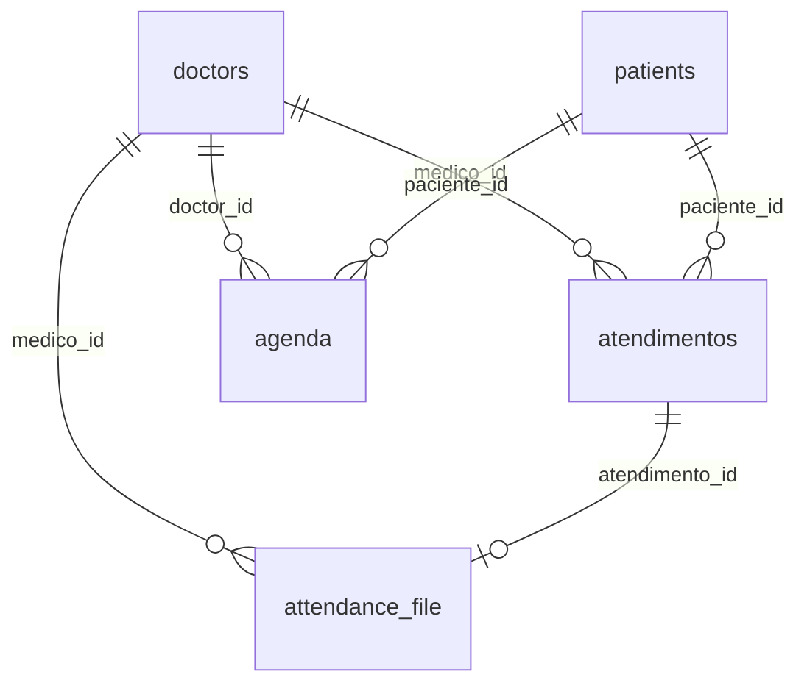

# Database — PEP SoMed

## SGBD

| Especificação | Detalhe |
|---|---|
| **SGBD** | PostgreSQL 16 (Alpine) |
| **Container** | `pep-emr-db` |
| **Porta (dev)** | `5432` (Docker, mapeada para `5433` em caso de conflito local) |
| **Usuário** | `postgres` |
| **Senha** | `postgres` |
| **Database** | `pep_emr` |
| **Migration** | Automática via `server/db.js` (tabela `schema_migrations` rastreia arquivos aplicados) |

---

## DDL — Schema das Tabelas

O schema é definido no arquivo `server/migrations/001_initial_schema.sql` e aplicado automaticamente na inicialização do servidor.

### `doctors`

Médicos cadastrados no sistema, com suporte a credenciais Google OAuth2.

```sql
CREATE TABLE IF NOT EXISTS doctors (
  id                  SERIAL PRIMARY KEY,
  nome                TEXT NOT NULL,
  clinic_id           INTEGER NOT NULL DEFAULT 1,
  google_access_token TEXT,
  google_refresh_token TEXT,
  google_calendar_id  TEXT,
  data_criacao        TIMESTAMPTZ NOT NULL DEFAULT CURRENT_TIMESTAMP
);
```

| Coluna | Tipo | Restrições | Descrição |
|---|---|---|---|
| `id` | `SERIAL` | `PRIMARY KEY` | ID auto-incremento |
| `nome` | `TEXT` | `NOT NULL` | Nome do médico |
| `clinic_id` | `INTEGER` | `NOT NULL` (default 1) | ID da clínica |
| `google_access_token` | `TEXT` | — | Token de acesso Google OAuth |
| `google_refresh_token` | `TEXT` | — | Token de refresh Google OAuth |
| `google_calendar_id` | `TEXT` | — | ID do calendário Google (default: "primary") |
| `data_criacao` | `TIMESTAMPTZ` | `NOT NULL` (default now) | Data de criação |

**Seed inicial (3 médicos):**
```sql
INSERT INTO doctors (id, nome, clinic_id) VALUES
  (1, 'Dr. Marco Silva', 1),
  (2, 'teste Dr', 1),
  (3, 'Dra. Ana Costa', 1);
```

---

### `patients`

Pacientes cadastrados no sistema.

```sql
CREATE TABLE IF NOT EXISTS patients (
  id          UUID PRIMARY KEY DEFAULT gen_random_uuid(),
  full_name   TEXT NOT NULL,
  birth_date  DATE NOT NULL,
  email       TEXT UNIQUE,
  phone       TEXT,
  document    TEXT,
  kommo_id    TEXT,
  created_at  TIMESTAMPTZ NOT NULL DEFAULT CURRENT_TIMESTAMP,
  updated_at  TIMESTAMPTZ NOT NULL DEFAULT CURRENT_TIMESTAMP
);
```

| Coluna | Tipo | Restrições | Descrição |
|---|---|---|---|
| `id` | `UUID` | `PRIMARY KEY` (default `gen_random_uuid()`) | Identificador único |
| `full_name` | `TEXT` | `NOT NULL` | Nome completo |
| `birth_date` | `DATE` | `NOT NULL` | Data de nascimento |
| `email` | `TEXT` | `UNIQUE` | E-mail |
| `phone` | `TEXT` | — | Telefone |
| `document` | `TEXT` | — | CPF / documento |
| `kommo_id` | `TEXT` | — | ID do contato no CRM Kommo |
| `created_at` | `TIMESTAMPTZ` | `NOT NULL` (default now) | Data de criação |
| `updated_at` | `TIMESTAMPTZ` | `NOT NULL` (default now) | Data de atualização |

**Seed inicial (4 pacientes):**
```sql
-- Dara Amaral, Teste memed, João Pedro, Maria Santos
```

---

### `crm_settings`

Configurações de integração com CRM (Kommo).

```sql
CREATE TABLE IF NOT EXISTS crm_settings (
  id            UUID PRIMARY KEY DEFAULT gen_random_uuid(),
  provider_name TEXT NOT NULL DEFAULT 'kommo',
  api_key       TEXT NOT NULL,
  subdomain     TEXT NOT NULL,
  created_at    TIMESTAMPTZ NOT NULL DEFAULT CURRENT_TIMESTAMP,
  updated_at    TIMESTAMPTZ NOT NULL DEFAULT CURRENT_TIMESTAMP
);
```

| Coluna | Tipo | Restrições | Descrição |
|---|---|---|---|
| `id` | `UUID` | `PRIMARY KEY` | Identificador único |
| `provider_name` | `TEXT` | `NOT NULL` (default 'kommo') | Nome do provedor CRM |
| `api_key` | `TEXT` | `NOT NULL` | Chave de API |
| `subdomain` | `TEXT` | `NOT NULL` | Subdomínio da conta |
| `created_at` | `TIMESTAMPTZ` | `NOT NULL` (default now) | Data de criação |
| `updated_at` | `TIMESTAMPTZ` | `NOT NULL` (default now) | Data de atualização |

> Apenas **um** registro de cada provider é mantido (upsert por `provider_name`).

---

### `atendimentos`

Registros de atendimento (prontuário).

```sql
CREATE TABLE IF NOT EXISTS atendimentos (
  id                          SERIAL PRIMARY KEY,
  medico_id                   INTEGER NOT NULL REFERENCES doctors(id),
  paciente_id                 UUID NOT NULL REFERENCES patients(id),
  anamnese_draft              TEXT,
  orientacao_draft            TEXT,
  laudo_draft                 TEXT,
  atestado_declaracao_draft   TEXT,
  pedido_exames_draft         TEXT,
  prescription_draft          TEXT,
  consentimento_lgpd_draft    TEXT,
  data_hora_criacao           TIMESTAMPTZ NOT NULL DEFAULT CURRENT_TIMESTAMP
);

CREATE INDEX IF NOT EXISTS idx_atendimentos_paciente ON atendimentos (paciente_id);
```

| Coluna | Tipo | Restrições | Descrição |
|---|---|---|---|
| `id` | `SERIAL` | `PRIMARY KEY` | ID auto-incremento |
| `medico_id` | `INTEGER` | `REFERENCES doctors(id)` | Médico responsável |
| `paciente_id` | `UUID` | `REFERENCES patients(id)` | Paciente atendido |
| `anamnese_draft` | `TEXT` | — | Rascunho (JSON: `{"texto": "<html>"}`) |
| `orientacao_draft` | `TEXT` | — | Rascunho (JSON) |
| `laudo_draft` | `TEXT` | — | Rascunho (JSON) |
| `atestado_declaracao_draft` | `TEXT` | — | Rascunho (JSON) |
| `pedido_exames_draft` | `TEXT` | — | Rascunho (JSON) |
| `prescription_draft` | `TEXT` | — | Rascunho (JSON) |
| `consentimento_lgpd_draft` | `TEXT` | — | Rascunho (JSON) |
| `data_hora_criacao` | `TIMESTAMPTZ` | `NOT NULL` (default now) | Data de criação |

> Os 7 campos de rascunho armazenam JSON. Quando vazios, contêm `{"texto": ""}`.

**Módulos (FIELD_MAP):**
| Chave | Coluna no banco |
|---|---|
| `anamnese` | `anamnese_draft` |
| `orientacao` | `orientacao_draft` |
| `laudo` | `laudo_draft` |
| `atestado_declaracao` | `atestado_declaracao_draft` |
| `pedido_exames` | `pedido_exames_draft` |
| `prescription` | `prescription_draft` |
| `consentimento_lgpd` | `consentimento_lgpd_draft` |

---

### `attendance_file`

Registro de documentos gerados ao finalizar um atendimento.

```sql
CREATE TABLE IF NOT EXISTS attendance_file (
  id                            SERIAL PRIMARY KEY,
  atendimento_id                INTEGER NOT NULL REFERENCES atendimentos(id) ON DELETE CASCADE,
  medico_id                     INTEGER NOT NULL REFERENCES doctors(id),
  anamnese_url                  TEXT,
  orientacao_url                TEXT,
  laudo_url                     TEXT,
  atestado_declaracao_url       TEXT,
  pedido_exames_url             TEXT,
  prescription_url              TEXT,
  consentimento_lgpd_url        TEXT,
  data_hora_geracao             TIMESTAMPTZ NOT NULL DEFAULT CURRENT_TIMESTAMP
);
```

| Coluna | Tipo | Restrições | Descrição |
|---|---|---|---|
| `id` | `SERIAL` | `PRIMARY KEY` | ID auto-incremento |
| `atendimento_id` | `INTEGER` | `REFERENCES atendimentos(id) ON DELETE CASCADE` | Atendimento relacionado |
| `medico_id` | `INTEGER` | `REFERENCES doctors(id)` | Médico |
| `anamnese_url` | `TEXT` | — | URL do PDF gerado |
| `orientacao_url` | `TEXT` | — | URL do PDF gerado |
| ... | ... | ... | (mesmo padrão para os 7 módulos) |
| `data_hora_geracao` | `TIMESTAMPTZ` | `NOT NULL` (default now) | Data de geração |

> As URLs atualmente são mockadas: `https://storage.pep.local/atendimentos/{id}/{module}.pdf`

---

### `agenda`

Eventos da agenda médica (consultas e bloqueios).

```sql
CREATE TABLE IF NOT EXISTS agenda (
  id                SERIAL PRIMARY KEY,
  doctor_id         INTEGER NOT NULL REFERENCES doctors(id),
  clinic_id         INTEGER NOT NULL,
  tipo_evento       TEXT NOT NULL CHECK (tipo_evento IN ('CONSULTA', 'BLOQUEIO')),
  grupo_bloqueio_id TEXT,
  data_evento       DATE NOT NULL,
  hora_inicio       TIME NOT NULL,
  hora_fim          TIME NOT NULL,
  paciente_id       UUID REFERENCES patients(id),
  motivo_bloqueio   TEXT,
  google_event_id   TEXT,
  timezone          TEXT NOT NULL DEFAULT 'America/Sao_Paulo',
  data_criacao      TIMESTAMPTZ NOT NULL DEFAULT CURRENT_TIMESTAMP,
  CHECK (
    (tipo_evento = 'CONSULTA' AND paciente_id IS NOT NULL)
    OR
    (tipo_evento = 'BLOQUEIO' AND paciente_id IS NULL AND motivo_bloqueio IS NOT NULL)
  )
);

CREATE INDEX IF NOT EXISTS idx_agenda_clinic_date ON agenda (clinic_id, data_evento);
CREATE INDEX IF NOT EXISTS idx_agenda_doctor_date ON agenda (doctor_id, data_evento);
```

| Coluna | Tipo | Restrições | Descrição |
|---|---|---|---|
| `id` | `SERIAL` | `PRIMARY KEY` | ID auto-incremento |
| `doctor_id` | `INTEGER` | `REFERENCES doctors(id)` | Médico |
| `clinic_id` | `INTEGER` | `NOT NULL` | ID da clínica |
| `tipo_evento` | `TEXT` | `CHECK (IN ('CONSULTA','BLOQUEIO'))` | Tipo do evento |
| `grupo_bloqueio_id` | `TEXT` | — | UUID que agrupa bloqueios recorrentes |
| `data_evento` | `DATE` | `NOT NULL` | Data do evento |
| `hora_inicio` | `TIME` | `NOT NULL` | Hora de início |
| `hora_fim` | `TIME` | `NOT NULL` | Hora de fim |
| `paciente_id` | `UUID` | `REFERENCES patients(id)` | Paciente (obrigatório em CONSULTA) |
| `motivo_bloqueio` | `TEXT` | — | Motivo (obrigatório em BLOQUEIO) |
| `google_event_id` | `TEXT` | — | ID do evento no Google Calendar |
| `timezone` | `TEXT` | `NOT NULL` (default 'America/Sao_Paulo') | Fuso horário |
| `data_criacao` | `TIMESTAMPTZ` | `NOT NULL` (default now) | Data de criação |

**Check constraint** (validação a nível de banco):
```
CONSULTA → paciente_id IS NOT NULL
BLOQUEIO → paciente_id IS NULL AND motivo_bloqueio IS NOT NULL
```

**Índices:**
- `idx_agenda_clinic_date` — `(clinic_id, data_evento)` — consultas por clínica + data
- `idx_agenda_doctor_date` — `(doctor_id, data_evento)` — consultas por médico + data

---

### `schema_migrations`

Controle interno de migrations (gerenciada pelo `db.js`).

```sql
CREATE TABLE IF NOT EXISTS schema_migrations (
  id          SERIAL PRIMARY KEY,
  filename    TEXT NOT NULL UNIQUE,
  applied_at  TIMESTAMPTZ NOT NULL DEFAULT CURRENT_TIMESTAMP
);
```

---

## Relacionamentos entre Tabelas



### Cardinalidades

| Origem | Destino | Tipo | Chave Estrageira |
|---|---|---|---|
| `atendimentos` | `doctors` | M:1 | `medico_id REFERENCES doctors(id)` |
| `atendimentos` | `patients` | M:1 | `paciente_id REFERENCES patients(id)` |
| `attendance_file` | `atendimentos` | 1:1 | `atendimento_id REFERENCES atendimentos(id) ON DELETE CASCADE` |
| `attendance_file` | `doctors` | M:1 | `medico_id REFERENCES doctors(id)` |
| `agenda` | `doctors` | M:1 | `doctor_id REFERENCES doctors(id)` |
| `agenda` | `patients` | M:1 (opcional) | `paciente_id REFERENCES patients(id)` |

> A tabela `crm_settings` é independente (não possui chaves estrangeiras para outras tabelas).

---

## Constraints Importantes

1. **`agenda.CHECK`** — Garante integridade dos dados:
   - Consultas sempre têm paciente
   - Bloqueios nunca têm paciente e sempre têm motivo

2. **`patients.email UNIQUE`** — Impede duplicidade de e-mail

3. **`patients.document`** — CPF/documento sem constraint unique (campo livre)

4. **`schema_migrations.filename UNIQUE`** — Garante que cada migration seja aplicada uma única vez

5. **`attendance_file.atendimento_id ON DELETE CASCADE`** — Remove os arquivos se o atendimento for excluído

---

## Notas Técnicas

- **UUIDs:** Gerados via extensão `pgcrypto` (`gen_random_uuid()`) para pacientes e crm_settings
- **Timestamps:** Todos usam `TIMESTAMPTZ` (com timezone) para consistência entre fusos
- **Rascunhos:** Armazenados como `TEXT` contendo JSON serializado (`{"texto": "<html>"}`)
- **Índices:** Apenas os essenciais estão criados (por clínica/data e médico/data na agenda, e por paciente nos atendimentos)
